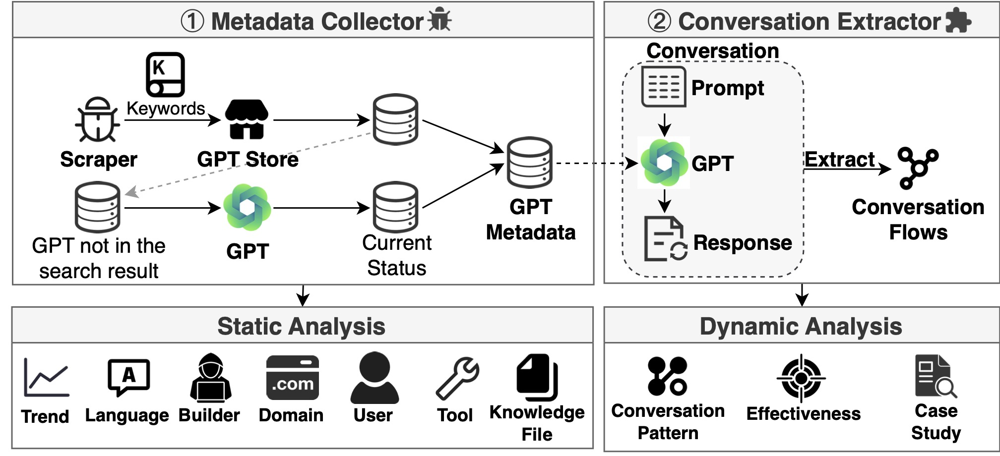

<p align="center">
  
</p>

# 👣 GPTracker

[]()
[](#license)

This is the official repository of the IEEE S&P 2025 paper [**GPTracker: A Large-Scale Measurement of Misused GPTs**]().

In this paper, we introduce **GPTracker**, a framework designed to continuously collect GPTs from the [official GPT Store](http://chat.openai.com/gpts) and automate the interaction with them.

**✨ Key Features of GPTracker:**

* **Directly collected from the official GPT Store**: All metadata are directly collected from the official GPT Store, rather than from third-party GPT collection websites, thereby avoiding issues such as data loss and delayed synchronization.
* **Bi-Weekly Tracking**: GPTracker has been running on a **bi-weekly basis since March 26, 2024.** This enables GPTracker and the research community to continuously trace the evolving landscape of GPTs.

As of the paper submission date (November 14, 2024), GPTracker has completed 16 data collection rounds over 8 months.
The number of collected GPTs has grown from 511,476 on March 26 to 755,297 by October 23, 2024.

[TOC]


## 📰 Update Logs

| **Date**       | **Number of GPTs** | **Available GPTs** | **Unavailable GPTs** |
| -------------- | ------------------ | ------------------ | -------------------- |
| **2024-10-23** | 755297             | 716389             | 38908                |
| **2024-10-09** | 744661             | 708055             | 36606                |
| **2024-09-25** | 721891             | 689951             | 31940                |
| **2024-09-11** | 720477             | 690072             | 30405                |
| **2024-08-28** | 709295             | 681210             | 28085                |
| **2024-08-14** | 696592             | 670192             | 26400                |
| **2024-07-31** | 685431             | 660685             | 24746                |
| **2024-07-17** | 674331             | 651022             | 23309                |
| **2024-07-03** | 627075             | 613595             | 13480                |
| **2024-06-19** | 618650             | 605173             | 13477                |
| **2024-06-05** | 612173             | 598693             | 13480                |
| **2024-05-22** | 598550             | 584971             | 13579                |
| **2024-05-08** | 580135             | 570070             | 10065                |
| **2024-04-24** | 564456             | 557004             | 7452                 |
| **2024-04-10** | 544224             | 540762             | 3462                 |
| **2024-03-26** | 511476             | 511476             | -                    |


## 🛢️ Data

All collected `metadata`  is available in the [Releases](https://github.com/TrustAIRLab/GPTracker/releases).

We use [zstd](https://github.com/facebook/zstd) to compress the original data to save space.

To decompress, use the following command:

```
 zstd -d -k -T0 all_2024-10-23.csv.zst -o all_2024-10-23.csv
```

* `-k`: Keep the original compressed file.
* `-T0`: Use all available CPU threads to speed up decompression.

After decompression, you will get a file named `all_{round_day}.csv`, which contains the following 5 columns:


| Column   | Description                                                  |
| -------- | ------------------------------------------------------------ |
| gizmo_id | Unique GPT ID                                                |
| from     | `search` (discovered via keyword search) or `fill` (accessed directly via URL), check the paper for details. |
| json     | GPT metadata (see example below)                             |
| status   | `available` or `unavailable` during that round               |
| round    | Collection round date (runs bi-weekly)                       |

Note:
* To protect personal information, we anonymize the details of the linked social media accounts, storing only the keyword `linkedin`, `github`, and `X` in the "display_socials" field to indicate whether the authors have provided them.
* The data structure of the 2024-03-26 round differs from later rounds because it was the crawler’s first run. We optimized the storage logic in subsequent rounds. However, this does not affect our analysis, as the data from this round still contains key information.

Example of the `json` field:
```
{
    "gizmo": {
        "id": "g-9upSdCEcq",
        "organization_id": "org-pKunmlIixNlYhJKR8QfVDKUc",
        "short_url": "g-9upSdCEcq-anschreiben-generator",
        "author": {
            "user_id": "user-sgmDTtNbVFXMroGYwKOPHjJx",
            "display_name": "Ruff_consult GmbH",
            "link_to": null,
            "is_verified": true,
            "selected_display": "name",
            "will_receive_support_emails": null,
            "display_socials": []
        },
        "voice": {
            "id": "ember"
        },
        "workspace_id": null,
        "model": null,
        "instructions": null,
        "settings": null,
        "display": {
            "name": "Anschreiben Generator",
            "description": "Hilft dabei perfekte Anschreiben bzw. Motivationsschreiben zu generieren.",
            "prompt_starters": [
                "Helfe mir bei meiner Bewerbung!"
            ],
            "profile_pic_id": null,
            "profile_picture_url": null,
            "categories": [
                "writing"
            ]
        },
        "share_recipient": "marketplace",
        "created_at": "2024-03-01T09:47:39.027158+00:00",
        "updated_at": "2024-04-09T08:09:09.110264+00:00",
        "last_interacted_at": null,
        "num_interactions": null,
        "tags": [
            "public",
            "reportable"
        ],
        "version": null,
        "live_version": null,
        "training_disabled": null,
        "sharing_targets": null,
        "appeal_info": null,
        "vanity_metrics": {
            "num_conversations": null,
            "num_conversations_str": "80+",
            "created_ago_str": "\u4e0a\u4e2a\u6708",
            "review_stats": {
                "total": 0,
                "count": 0,
                "by_rating": {}
            }
        },
        "workspace_approval_date": null,
        "workspace_approved": null,
        "sharing": null,
        "current_user_permission": {
            "can_read": true,
            "can_view_config": false,
            "can_write": false,
            "can_delete": false,
            "can_export": false,
            "can_share": false
        }
    },
    "tools": [
        {
            "id": "gzm_cnf_XrcAlcB8rgJVe8gNF1qXrCmM~gzm_tool_j9iAVllphfBxn96ZfJhZI4gJ",
            "type": "dalle",
            "settings": null,
            "metadata": null
        },
        {
            "id": "gzm_cnf_XrcAlcB8rgJVe8gNF1qXrCmM~gzm_tool_7QQ65yi4xZixLmbRvuOdlU7w",
            "type": "browser",
            "settings": null,
            "metadata": null
        }
    ],
    "files": [],
    "product_features": {
        "attachments": {
            "type": "retrieval",
            "accepted_mime_types": [
                "text/plain",
                "text/x-script.python",
                "text/x-typescript",
                "application/vnd.openxmlformats-officedocument.wordprocessingml.document",
                "text/x-sh",
                "application/json",
                "text/x-c++",
                "text/x-ruby",
                "text/x-tex",
                "text/x-csharp",
                "application/pdf",
                "text/markdown",
                "text/x-c",
                "text/javascript",
                "text/html",
                "application/x-latext",
                "text/x-java",
                "text/x-php",
                "application/msword",
                "application/vnd.openxmlformats-officedocument.presentationml.presentation"
            ],
            "image_mime_types": [
                "image/png",
                "image/gif",
                "image/jpeg",
                "image/webp"
            ],
            "can_accept_all_mime_types": true
        }
    }
}
```


## 🤖 LLM-Driven Scoring System


## 🛡️ Ethics & Disclosure

Our study involves online data collection on the GPT Store, which could raise legal and ethical considerations. First, our study has been approved by our institution’s Institutional Review Board (IRB). In close collaboration with our Data Protection and Management Department, we formulated a data management plan to ensure our study complies with GDPR. Throughout all steps, only the authors of this paper conduct the annotations, and no external participants are involved. We have also taken utmost care to ensure that our testing does not disrupt services, harm users, or cause any unintentional damage. Specifically, we query GPTs using four registered accounts, strictly adhering to query limitations. We explicitly disable the “improve the model for everyone” setting for all accounts to opt out of model training. According to OpenAI, all interactions with GPT are invisible to the GPT builder and other users, ensuring the harmless of our queries. We also delete the chat history to minimize the impact on target platforms after each query session. During our experiments, we responsibly disclosed our findings to OpenAI.

**This repo is intended for research purposes only. Any misuse is strictly prohibited.**


## 📚 Citation

If you find this useful in your research, please consider citing:

```bibtex
@inproceedings{SSBZ25,
  author = {Xinyue Shen and Yun Shen and Michael Backes and Yang Zhang},
  title = {{GPTracker: A Large-Scale Measurement of Misused GPTs}},
  booktitle = {{IEEE Symposium on Security and Privacy (S\&P)}},
  publisher = {IEEE},
  year = {2025}
}
```
